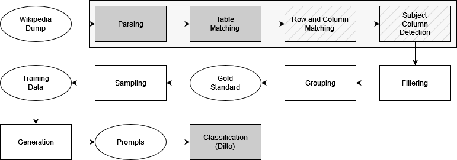

# Leveraging Data Histories to Improve Entity Resolution

This repository contains the source code and data to test the impact of data histories on entity resolution using Ditto [1]. It is part of the equally named master's thesis that was handed in on the 1st of December 2023 at [Hasso Plattner Institut](https://hpi.de/) and supervised by [Prof. Dr. Naumann](https://hpi.de/naumann/people/felix-naumann.html).

## Summary

In short, the code extracts a set of (table) rows from Wikipedia, including their entire history. Based on that, it provides a set of command-line utilities to generate so-called prompts that Ditto can classify.
Please refer to the corresponding master's thesis for an extensive description of the pipeline and experimental setup.



## Prerequisites

:warning: **Archives are provided by [Git LFS](https://git-lfs.com/)**. Installation might be required to retrieve the .7z files correctly when cloning.

To run the source code, [python](https://www.python.org/) is required. Set up other requirements by running:

```shell
./install.sh
pip3 install -r requirements.txt
```

In addition, the file [ditto_env.yaml](ditto_env.yaml) contains information about the environment used to run Ditto.

Setup the repository as follows:

```shell
# Setup the submodules
git submodule init
git submodule update

# Copy Ditto's config file
mv -f ditto_config.json ditto/config.json

# Extract the data archives
mkdir data
7z x prompts.7z -odata/
7z x train.7z -odata/
7z x gold-standard.7z -odata/
```

## Running

In general, the depicted pipeline runs for multiple days. [data.7z](data.7z) contains 1) the annotated gold standard, 2) the sampled training data with 200.000 pairs, and 3) the generated prompts. Hence, it is possible to shortcut some stages and start with data based on a [dump of the English Wikipedia from the 1st of June 2023](https://dumps.wikimedia.org/enwiki/20230601/).

### Stages 1-4

Please refer to the submodule [wiki-row-col-matcher](wiki-row-col-matcher).

### Filtering

This stage takes the input from Stage 4 and applies a set of filter rules. Moreover, it extracts the wikilinks in the subject column that are used as labels.

```shell
python3 cli.py filter <input_path> data/gold-standard --force
```

### Grouping & Sampling

Grouping by links and sampling the training pairs is done in a single command. The command randomly chooses s/2 row pairs that refer to the same article (considered a match) and s/2 row pairs with different links (considered a non-match) that follow the (Jaccard) similarity distribution of the matches.
That way, the matches and non-matches can not be distinguished just by their similarity. Thus, the model has to learn "harder".

```shell
python3 cli.py sample data/gold-standard data/train -s 200000
```

### Generation

A set of formatters implement the different proposed serialization methods. Please refer to the documentation of the classes in [sampling/formatter](sampling/formatter).
To generate prompts following the ```roUnq``` called format, use the following command:

```shell
python3 cli.py gen-prompts data/train data/prompts -fmt ro_concat_hist -fs DISTINCT True -fs SEP False
```

### Classification

For the final classification using Ditto, use the following command:

```shell
export CUDA_VISIBLE_DEVICES=0;
python3 ditto/train_ditto.py \
    --task xl_roUnq \
    --batch_size 64 \
    --max_len 256 \
    --lr 3e-5 \
    --n_epochs 40 \
    --lm roberta \
    --fp16 \
    --logdir <log_path> \
    --save_model
```

# Bibliography

[1]     Y. Li, J. Li, Y. Suhara, A. Doan, and W. C. Tan, “Deep entity matching with-trained language models”, Proceedings of the VLDB Endowment, vol. 14, no. 1, 2020, issn: 21508097. doi: 10.14778/3421424.3421431. [Online]. Available: [https://arxiv.org/abs/2004.00584](https://arxiv.org/abs/2004.00584)